# Prism Launcher 使い方

## 前準備
1. Prism Launcherインストール

    - https://prismlauncher.org/

2. packwiz-installerをダウンロード

    - https://github.com/packwiz/packwiz-installer-bootstrap/releases/latest

## 起動構成作成
1. 「起動構成を追加」を押下

    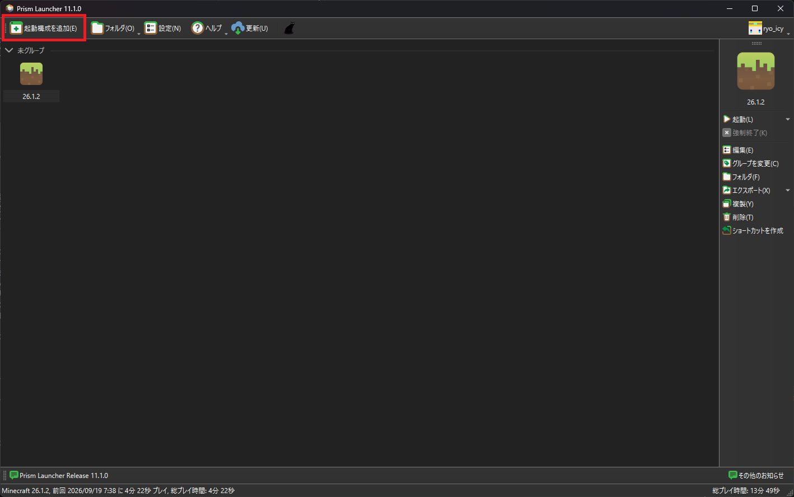

2. 「名前」、「バージョン」、「Modローダー」を設定し、「OK」を押下

    - 名前：任意
    - バージョン：1.21.1
    - Modローダー：NeoForge / バージョン：21.1.250

    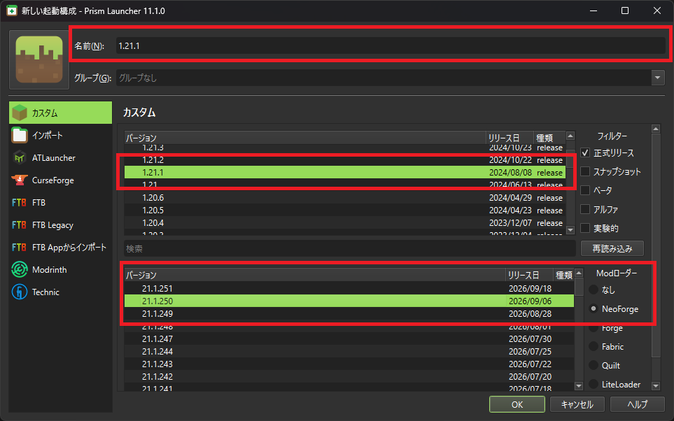

3. 「フォルダ」を押下

    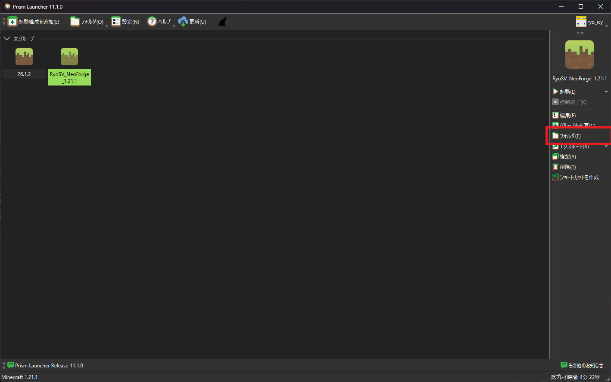

4. `minecraft`フォルダに移動

    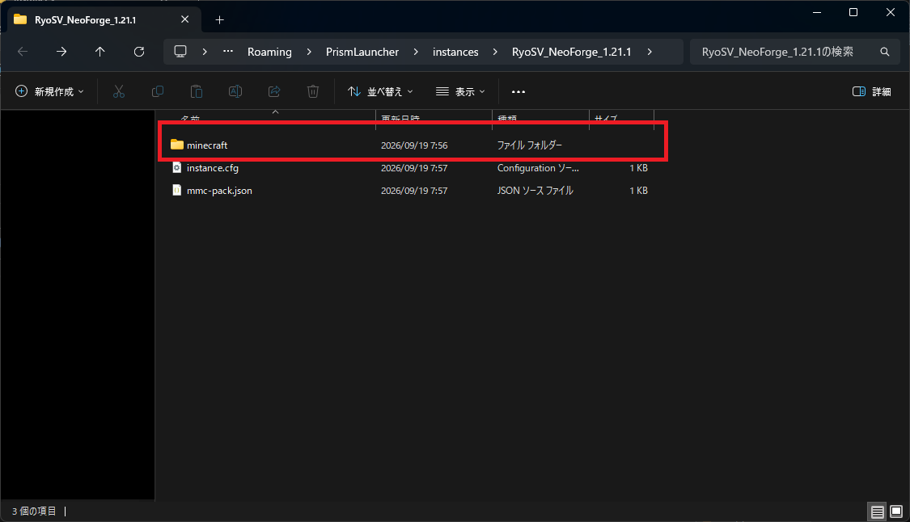

5. `packwiz-installer-bootstrap.jar`を配置

    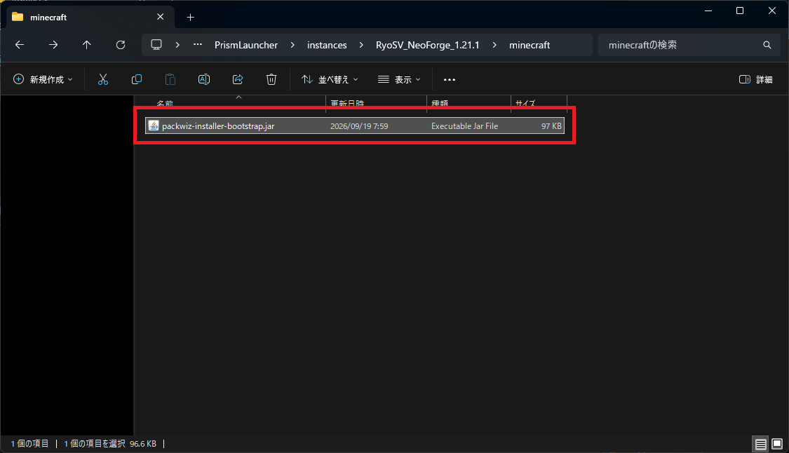

6. 「編集」を押下

    

7. 「設定」を押下

    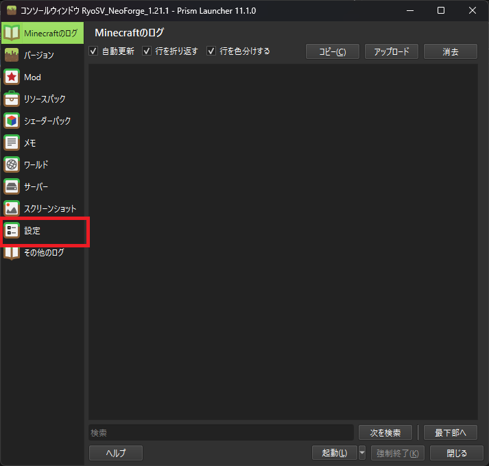

8. 「カスタムコマンド」を押下

    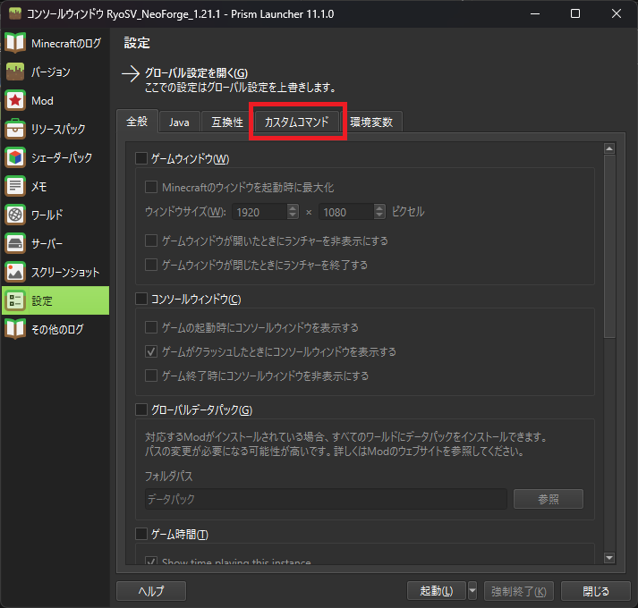

9. 「グルーバル設定を上書き」にチェック、起動前コマンドを設定し、「閉じる」を押下

    - 起動前コマンド：`$INST_JAVA -jar $INST_MC_DIR\packwiz-installer-bootstrap.jar https://ryo-server-developer.github.io/kikaku-neoforge-packwiz/pack.toml`

    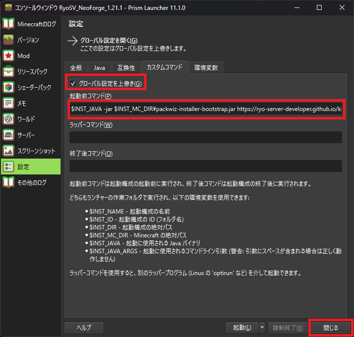

10. アイコンまたは「起動」を押下し、起動

    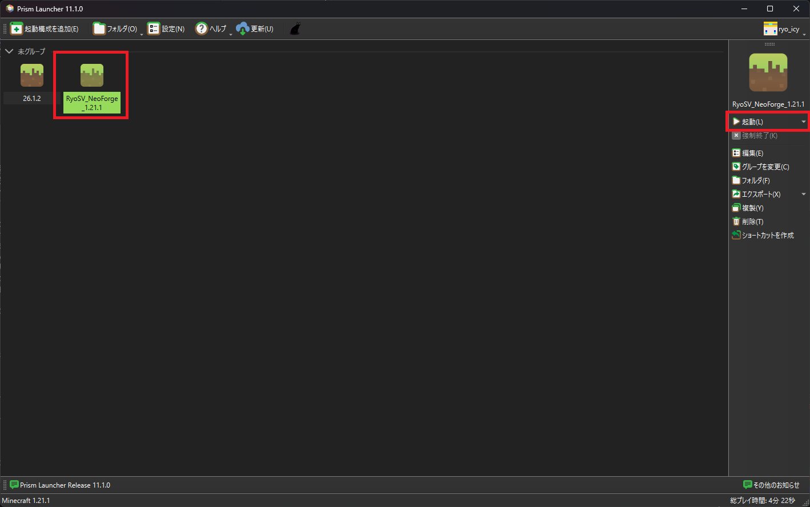

## Mod導入方法
1. 「編集」を押下

    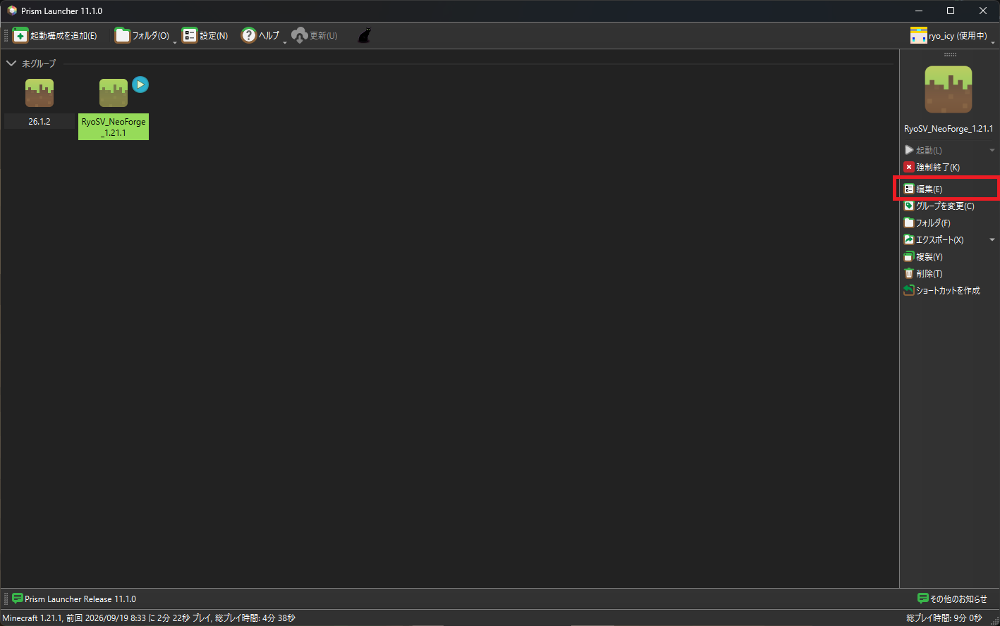

2. 「Mod」を押下

    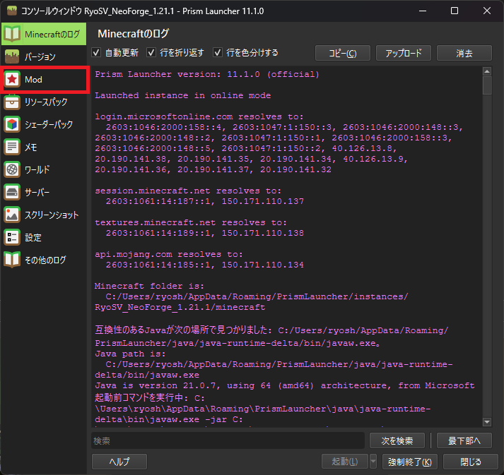

3. 「Modをダウンロード」を押下
    - 「フォルダを開く」から直接Modを導入することも可能

    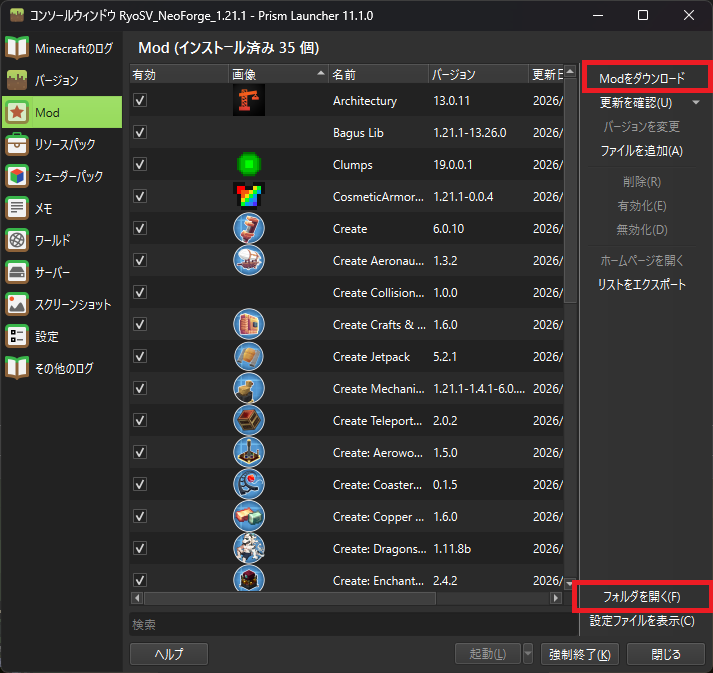

4. 検索バーに導入したいMod名を入力し、表示された結果にチェックをつけ、「確認」を押下

    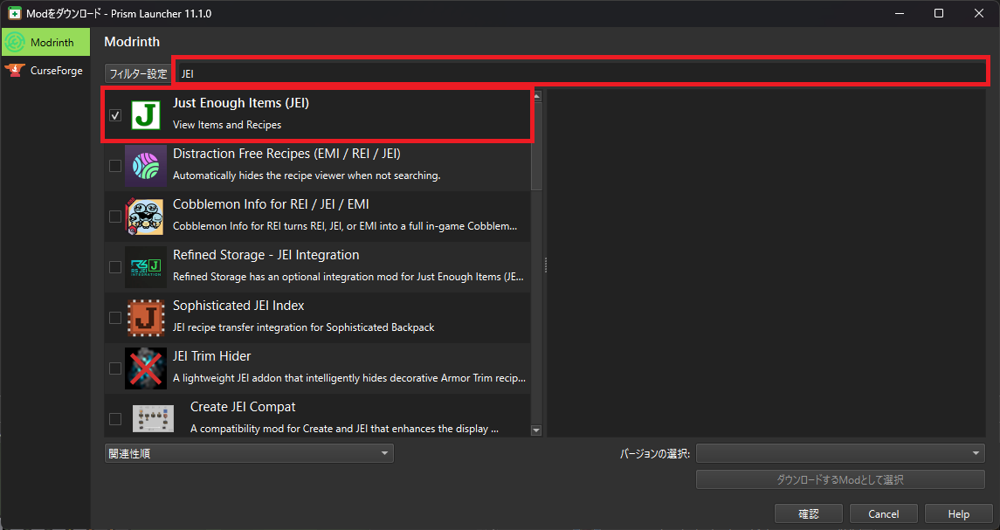

5. 表示された一覧に問題がなければ「OK」を押下

    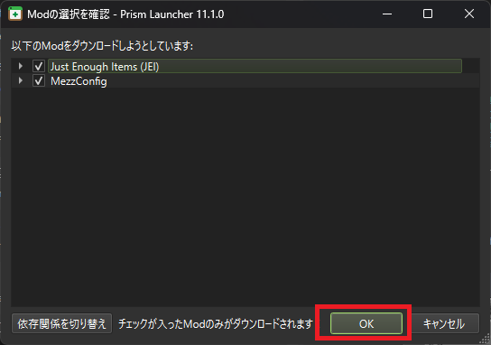
